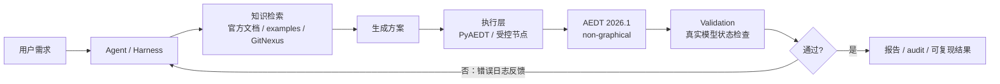
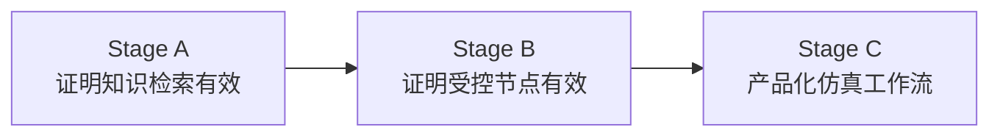
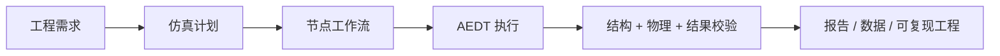

# AEDT Agent 阶段汇报

面向不熟悉 Ansys 仿真的团队，本报告只回答四个问题：

1. 这个 agent 是什么。
2. 为什么要分 Stage A/B/C。
3. 现在效果如何。
4. 未来要做到什么程度。

## 1. 一句话

我们在做一个 **CAE 仿真自动化 agent**：把工程师的自然语言任务，转成可执行、可验证、可追踪的 AEDT/PyAEDT 自动化流程。

> 可以把 AEDT 理解为一个复杂工程软件，PyAEDT 是它的 Python 自动化接口。难点不是写 Python 语法，而是 API 调用顺序、对象选择、端口/边界/setup 等工程语义非常容易错。

## 2. Agent 架构

关键闭环：

- agent 不是只生成代码，而是会拿真实执行错误继续修复。
- 判断依据不是“看起来像代码”，而是真实 AEDT 执行和 validation。
- Stage B 开始把高风险 API 调用封装成受控节点，减少任意代码风险。

## 3. 三个阶段差别

| 阶段 | 核心问题 | 方法 | 当前状态 |
| --- | --- | --- | --- |
| Stage A | 给足官方知识后，LLM 写 PyAEDT 是否明显变好？ | 自由代码 + 官方源码/examples + GitNexus | 已完成 |
| Stage B | 能否把高风险调用收敛成受控、可审计节点？ | JSON node plan + 本地节点执行 + validation | MVP 已完成 |
| Stage C | 能否产品化为稳定的仿真 workflow 系统？ | DAG runtime + 更强 validation + 更大任务集 | 下一阶段 |

阶段关系：

## 4. 当前效果

10 个固定 benchmark 任务，最多 3 次自动修复，判据为真实 AEDT non-graphical 执行 + validation。

### Stage A：知识检索是否有用

| 分组 | 说明 | 首轮成功率 | 三次内成功率 |
| --- | --- | ---: | ---: |
| Group A | 裸生成，不给工具 | 10% | 30% |
| Group B | 官方源码/examples + GitNexus | 80% | 100% |

结论：对 PyAEDT 这类高约束 API，**官方知识和图谱检索不是锦上添花，而是成功率的主要来源**。

### Stage B：受控节点是否有用

| 分组 | 说明 | 首轮成功率 | 三次内成功率 | 自由代码次数 |
| --- | --- | ---: | ---: | ---: |
| Group B | 工具增强自由 Python | 70% | 90% | 有 |
| Group C | 受控节点计划 | 80% | 100% | 0 |

结论：节点化路径在当前 10-task 上达到 **100% 三次内成功率**，同时把自由代码执行次数降为 **0**。

## 5. 为什么这件事有价值

自由代码路径的问题：

- LLM 可能调用不存在或版本不匹配的 API。
- 端口、边界、face selection 这类操作容易 runtime error。
- 失败后很难判断是模型理解错、API 调错，还是工程语义错。

受控节点路径的价值：

- 把危险 API 收敛到少量节点。
- 节点有 schema、输出、postcheck 和 audit。
- LLM 只生成结构化计划，系统负责执行和验证。
- 失败更容易被定位和修复。

## 6. 当前边界

当前结果不能被解释为“完整电磁仿真正确”。

当前 validation 检查的是结构性正确：

- 对象是否创建。
- 材料是否设置。
- 端口/边界/setup/sweep 是否存在。
- 关键引用关系是否合理。

未来还需要增强：

- 电磁语义检查。
- 求解结果检查。
- 更复杂模型和后处理任务。
- 长时间仿真的失败恢复。

## 7. 未来目标

| 能力 | 当前 | 目标 |
| --- | --- | --- |
| 任务生成 | 可完成 10-task MVP | 覆盖更多真实工程模板 |
| 执行方式 | 节点 plan 串行执行 | DAG workflow、可恢复、可追踪 |
| 正确性判断 | 结构性 validation | 结构 + 物理语义 + 结果检查 |
| 知识来源 | 官方源码/examples + GitNexus | 持续索引、版本感知、按任务检索 |
| 交付形式 | benchmark/report | 可被其他团队调用的仿真 agent 服务 |

最终形态：

## 8. 当前交付物

- 阶段性技术报告：`docs/aedt-agent-stage-progress-report.md`
- 非仿真团队汇报版：`docs/aedt-agent-executive-report.md`
- 汇报 HTML：`benchmarks/reports/aedt_agent_executive_report.html`
- Stage B 复现文档：`docs/stage-b-controlled-node-benchmark.md`
- Stage B 对照报告：`benchmarks/reports/stage_b_10task_compare.html`
- 一键报告脚本：`scripts/build_stage_b_report.py`

