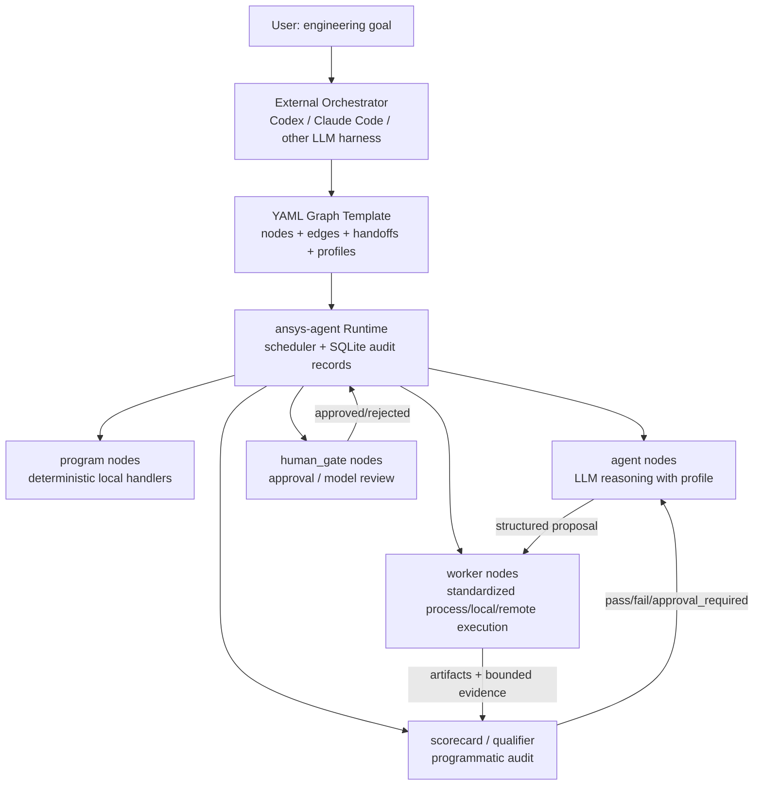

# ansys-agent 编排者 / Agent 节点 / Worker 架构说明

本文用于防止概念混淆：ansys-agent 不是“所有中间节点都是
LLM”的系统，也不是一个把仿真流程写死的脚本。它的核心是：

```text
外层编排者使用 LLM 理解目标和监管流程；
YAML graph 固化流程拓扑和 handoff 合约；
agent 节点使用 LLM 做判断和提案；
worker 节点使用标准化代码执行真实工程动作；
scorecard / qualifier 节点用程序审计证据。
```

## 结论先行

不是所有 worker 都是 LLM。

在当前 `brd_reviewed_model_optimize_loop` 里：

- `kind: agent` 才是 LLM 节点。
- `kind: worker` 默认不是 LLM，而是确定性的工程执行单元。
- `kind: program` 是本进程里的确定性程序处理。
- `kind: human_gate` 是审批/人工检查点。
- `scorecard` / `qualifier` 本质上是程序审计，不相信 LLM 自述。

当前 reviewed BRD 优化闭环里，真正走 LLM 的核心节点是：

```text
optimization_decider
```

它读取 bounded evidence 和候选动作，决定继续、完成、失败，还是请求
人工审批。它不直接打开 AEDT、不修改模型、不读取原始 S 参数/TDR 曲线。

## 为什么不能让所有 worker 都是 LLM

工程仿真闭环里有很多动作必须可复现、可审计、可回滚，例如：

- 打开 AEDT 并求解；
- 导出 `channel.s4p`；
- 导出 `Diff1` TDR CSV；
- 计算 `SDD11` / `SDD21` / TDR 指标；
- 校验反焊盘和非功能焊盘约束；
- 修改 AEDT 工作模型；
- 写优化历史 CSV 和 HTML 报告。

这些动作如果交给 LLM 自由执行，会出现三个问题：

1. 结果不可稳定复现。
2. 很难审计它到底改了什么。
3. 容易绕过工程约束、审批点和 artifact-only 原始数据策略。

所以 ansys-agent 的设计是：LLM 做工程判断，worker 做工程动作。

## 三层“大脑”与执行边界



### 1. 外层编排者

外层编排者可以是内置 ansys-agent、Claude Code、Codex，或者未来其它 harness。它可以用
LLM，因为它的职责是：

- 理解用户目标；
- 选择 YAML template；
- 准备初始 payload；
- 启动 `mission run-loop` 或手动 `run-graph` / `advance-graph`；
- 看 `graph-status`、Web dashboard、报告和失败原因；
- 在失败或审批点决定是否接管、重试或询问用户。

外层编排者不应该直接调用内部 worker 脚本来绕过 graph。

当前 ansys-agent 是项目内置的轻量专属编排器。它比通用 coding agent 更窄：

- 输入是一个 case config；
- 默认只使用 AEDT 工作站本机 `local_cli` profile；
- 只调用 preflight、run-loop、status 这类控制面；
- 输出面向人和轻量 UI 的 JSON 状态摘要；
- 遇到审批、失败、取消或成功即停止，不自行越权。

### 2. Graph 里的 agent 节点

`kind: agent` 是图里的 LLM 节点。它有自己的 `system_prompt`、handoff
schema 和 model profile。

适合 agent 节点的任务：

- 从 bounded evidence 判断下一步；
- 在候选动作中选择一个；
- 解释为什么需要人工审批；
- 判断继续优化还是收敛；
- 生成结构化 proposal。

不允许 agent 节点做的事：

- 直接调用 AEDT；
- 直接修改 `.aedt`；
- 读原始 S 参数/TDR 全曲线进上下文；
- 编造 stackup、层名、shape id、走线层、器件归类；
- 绕过几何约束和审批。

### 3. Worker 节点

`kind: worker` 是标准化执行单元。默认生产路径是在 AEDT 工作站本地通过
process harness / `local_cli` runner 执行。`ssh_remote` 只是拆分部署时的可选
runner：外层编排者不在 AEDT 机器上，而 worker 必须在远端 AEDT 机器本机调用
PyAEDT/AEDT。除非用户明确选择跨机器模式，编排者不应启动或假设 SSH。

worker 的规则：

- 输入是结构化 JSON handoff；
- 只执行一个 capability；
- 输出结构化 JSON；
- 生成 artifact / manifest；
- 不做自由规划；
- 不消耗 LLM token，除非未来明确把某个 capability 设计成
  LLM-backed worker，并在 YAML 和文档里显式标注。

当前策略是：如果一个节点需要 LLM 判断，它应该写成 `kind: agent`，
不要把隐藏 LLM 调用塞进 worker 内部。

## 当前 reviewed BRD loop 的节点分类

文件：`docs/agent_templates/brd_reviewed_model_optimize_loop.yaml`

| Node | Kind | 是否 LLM | 职责 |
| --- | --- | --- | --- |
| `prepare_working_project` | `program` | 否 | 把人工检查过的 source AEDT 复制/准备成 working project |
| `real_solve_worker` | `worker` | 否 | 打开 AEDT/PyAEDT，运行 setup/sweep |
| `touchstone_export_worker` | `worker` | 否 | 导出四端口 `channel.s4p` |
| `tdr_export_worker` | `worker` | 否 | 导出 `Diff1` TDR CSV/report |
| `channel_score_worker` | `worker` | 否 | 读取 artifact，计算 bounded SDD11/SDD21/TDR evidence |
| `iteration_qualifier_worker` | `worker` | 否 | 审计本轮 raw policy、S4P/differential 合约和 artifact 存在性 |
| `progress_report_worker` | `worker` | 否 | 写 `optimization_history.csv` 和进度报告 |
| `optimization_decider` | `agent` | 是 | 基于 bounded evidence 选择下一步、结束或失败 |
| `iteration_qualification_approval_gate` | `human_gate` | 否 | qualification 失败或证据不足时等人工确认 |
| `geometry_validator_worker` | `worker` | 否 | 校验反焊盘/NFP 层、中心、shape、半径和约束 |
| `optimization_failure` | `program` | 否 | 当前 loop 不做人审；decider/几何校验不可执行时 fail-closed |
| `model_edit_worker` | `worker` | 否 | 对 working AEDT 模型执行已验证几何修改 |
| `prepare_next_solve` | `program` | 否 | 生成下一轮 solve request |
| `optimization_report` | `worker` | 否 | 生成最终报告和审计输出 |

`action_approval_gate` 不属于当前 reviewed-model optimization loop。它属于
BRD/local-cut 第一版模型生成前的人审阶段；当前 loop 的输入前提是 AEDT
模型已经人工检查过。几何动作如果不能通过 `geometry_validator_worker`
的确定性约束，应 fail-closed 并报告原因，而不是在优化迭代中等待 action
approval。

所以这条真实闭环不是“一堆 LLM worker 串起来”，而是：

```text
确定性执行 -> 确定性评分/审计 -> LLM 决策 -> 确定性校验 -> 确定性修改 -> 再求解
```

## LLM profile 怎么用

YAML graph 可以给 `kind: agent` 节点配置 profile：

```yaml
profiles:
  low_cost:
    model: gpt-4.1-mini
  standard:
    model: gpt-4.1-mini
  high_reasoning:
    model: gpt-4.1
```

例如当前 `optimization_decider` 使用：

```yaml
kind: agent
profile: high_reasoning
```

运行机器上可以通过环境变量把不同 profile 指到不同模型：

```powershell
$env:AEDT_AGENT_LLM_LOW_COST_MODEL = "gpt-4.1-mini"
$env:AEDT_AGENT_LLM_STANDARD_MODEL = "gpt-4.1-mini"
$env:AEDT_AGENT_LLM_HIGH_REASONING_MODEL = "gpt-4.1"
```

这解决的是“不同 LLM 节点用不同成本模型”的问题，不代表所有 worker
都会调用 LLM。

## 数据流

```text
1. User / Orchestrator
   -> goal + config + constraints

2. Runtime
   -> create mission + graph_run

3. Workers
   -> AEDT solve / export / score / edit
   -> artifacts and manifests

4. Score / Qualifier
   -> bounded evidence:
      SDD11 worst, SDD21 worst, TDR peak/flatness,
      objective cost, pass/fail reason, artifact refs

5. Agent decider
   -> next_action JSON:
      decision, selected_action, constraints_checked,
      tdr_observation_port, risk, rollback

6. Geometry validator + optional human gate
   -> executable or blocked

7. Model edit worker
   -> edited working project + edit manifest

8. Loop
   -> solve again or final report
```

原始 `s4p` 和 TDR CSV 始终是 artifact-only。LLM 只看压缩指标、必要的
manifest 路径、报告和 bounded evidence。

## 和“一个编排者，多个单职责 worker，用 pipeline 完成项目”的关系

这正是当前目标架构：

```text
Orchestrator
  -> YAML graph
    -> agent/program/worker/human_gate/scorecard nodes
      -> SQLite audit records + artifacts + reports
```

不同点只是命名更精确：

- “大脑”不只有一个位置：外层编排者是总控大脑，graph 里的
  `kind: agent` 是局部推理节点。
- “worker”不是 LLM，而是受控执行器。
- “pipeline”不是写死在 Python 里的 if/else，而是 YAML graph 的
  nodes/edges/handoffs。
- “审计”不是 LLM review，而是 scorecard/qualifier 查数据库记录和 artifact。

## 设计红线

- 不把 raw S 参数/TDR 全曲线喂给 LLM。
- 不让 LLM 直接自由改 AEDT。
- 不让 worker 偷偷承担规划/决策职责。
- 不让 run-loop 变成隐藏脚本；它只能创建、推进、轮询 graph。
- 不为每轮仿真生成一堆 AEDT 中间项目；只复制一份 working project 并持续修改。
- 任何缺少层、shape、中心、约束、端口方向证据的动作，都必须进入审批或失败。

## 一句话版本

ansys-agent 的正确形态是：

```text
LLM 负责“想清楚下一步该做什么”；
worker 负责“按标准把这件事做完并留下证据”；
scorecard 负责“查证据确认它真的做对了”。
```
